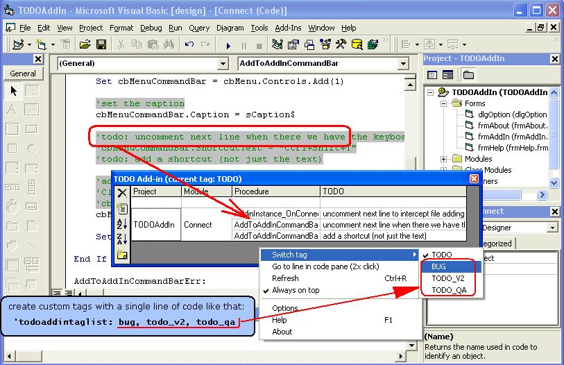



## TODO Reminder Add\-In \(v1\.4\)

### Description

Manages TODO tags left in code for future improvements. It doesn't use and database for storing the tasks but rather than that, it uses comment lines that start with TODO: string.

A ToDo tag will be a comment line beginning with 'todo:' string and followed by a decription of what remains to be done there. You can place such comment lines anywhere in the code and you can find them easily with this add-in.

Example of such a line:

'todo: place the code for paste here

(see the picture, it contains such lines of code and thw way they look in todo list).

----

NEW in v1.4:

-minor toolbar changes

----

NEW in v1.3:

-the number of tags is shown in add-in's window titlebar

-toolbar can be aligned to the left or to the top (new option in options dialog)

-the grid doesn't contain an empty line anymore

-last column always took the entire grid space

-reduced the flicker associated with grid refresh etc.
 
### More Info
 
a ToDo tag will be a comment line beginning with 'todo:' string and followed by a decription of what remains to be done there. You can place such comment lines anywhere in the code and you can find them easily with this add-in.

Example of such a line:

'todo: place the code for paste here.

You can define custom tags too. Just insert a line like this into your source code:

'todoaddintaglist: bug, todo_v2

and you'll have two more tags: bug and todo_v2 that you can manage. Select the tag you want from the pop-up menu.

Compile the DLL and use add-in manager to start it. It will appear in Add-Ins menu and when clicked it will display a window with all the TODO tags in your open projects. Select one by 2xclicking on the line with it in the flexgrid and the module containing the line with the tag will be openend with the line selected.

             |
---                |---
**Submitted On**   |2004-03-30 15:21:50
**By**             |[OviB](https://github.com/Planet-Source-Code/PSCIndex/blob/master/ByAuthor/ovib.md)
**Level**          |Intermediate
**User Rating**    |4.9 (94 globes from 19 users)
**Compatibility**  |VB 6\.0
**Category**       |[VB function enhancement](https://github.com/Planet-Source-Code/PSCIndex/blob/master/ByCategory/vb-function-enhancement__1-25.md)
**World**          |[Visual Basic](https://github.com/Planet-Source-Code/PSCIndex/blob/master/ByWorld/visual-basic.md)
**Archive File**   |[TODO\_Remin1735634202004\.zip](https://github.com/Planet-Source-Code/ovib-todo-reminder-add-in-v1-4__1-52615/archive/master.zip)

